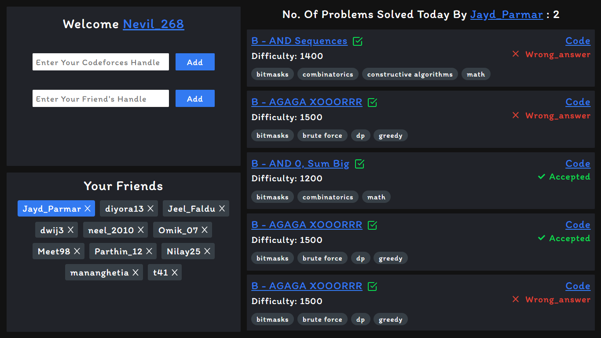
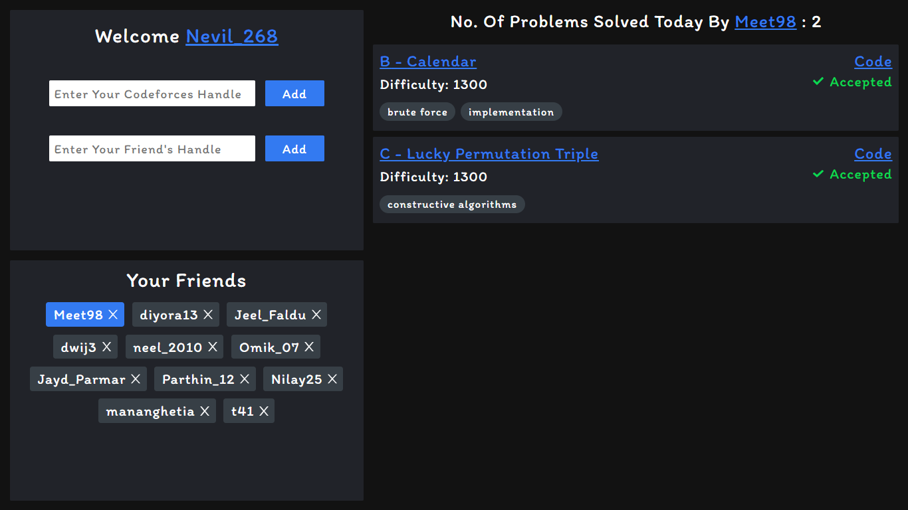

## Codeforces Submission Tracker

### The codeforces submission tracker is built using ReactJs and Codeforces API. In the first input field we have to enter our codeforces handle and in the second input field we have to enter our friends codeforces handle. So we can add as many friends as we want to add into it. 

### So on clicking on the friends handle you will be able to see today's submissions done by him/her and the number of questions solved by him/her. The tick mark on the right of the question's name will denote that whether you have done that question or not. If you have already done that question then it will show green tick otherwise it won't show anything.
 

